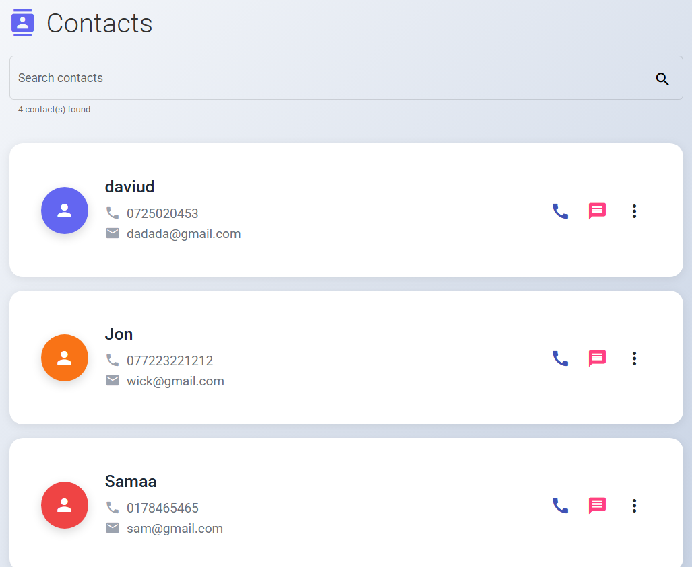

# 📱 Phonebook App (Frontend - Angular and Backend .NET)

This is the **Angular frontend** of the Phonebook Application, designed to interact with a .NET Core Web API backend. It allows users to manage their phonebook contacts efficiently with a user-friendly interface powered by **Angular Material**.


---

## ⚙️ Technologies Used

- [Angular 17+](https://angular.io/)
- [Angular Material](https://material.angular.io/)
- [TypeScript](https://www.typescriptlang.org/)
- [RxJS](https://rxjs.dev/)
- SCSS/CSS for styling
- Integration with REST API (ASP.NET Core + SQLite)

---

## 🚀 Getting Started

### 📦 Prerequisites

---

## 📦 Project Structure
```bash
project-root/
│
├── PhonebookApi/ # .NET Core API backend
└── phonebook-angular/ # Angular frontend
```
## ▶️ How to Run the Project

### 1️⃣ Start the Backend (.NET Core API)

1. Navigate to the `PhonebookApi` directory.

2. Restore NuGet packages:

```bash
dotnet restore
```
Run the Web API:
```bash
dotnet run
```

This will start the backend server at:

The main API endpoint for contacts: https://localhost:5209/api/contacts

🧪 Swagger Documentation:
Visit the Swagger UI at
👉 http://localhost:5209/swagger/index.html

2️⃣ Start the Frontend (Angular App)
Navigate to the phonebook-angular folder.

Install dependencies:
```bash
npm install
ng serve
```
http://localhost:4200

🧱 Angular Material Modules Used
MatTableModule

MatFormFieldModule

MatInputModule

MatIconModule

MatButtonModule

MatDialogModule

MatToolbarModule

MatCardModule

MatSnackBarModule

✨ Features
✅ Add new contacts

✅ Edit and delete contacts

✅ Display all contacts using Angular Material table

✅ Modal-based form dialog for create/update

✅ Form validation and user-friendly feedback

✅ Responsive UI with Angular Material

📂 Folder Structure (Angular)

```bash
src/
├── app/
│   ├── components/
│   │   ├── contact-list/
│   │   └── contact-add/
│   ├── services/
│   │   └── contact.service.ts
│   └── app.module.ts
├── environments/
│   └── environment.ts
└── main.ts
```


